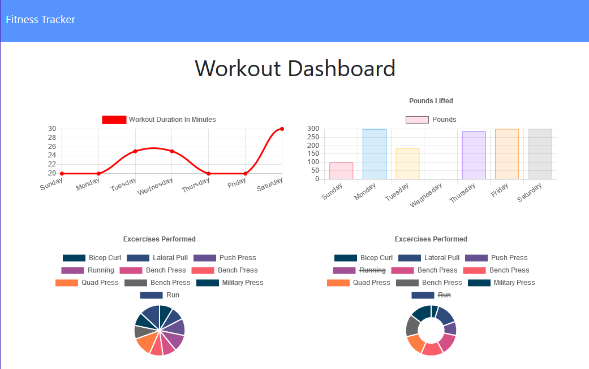

# 
Workout Tracker

 Workout tracker app using a backend built on Mongoose and Express and deployed to Heroku.

*****
## 
Table of Contents

* [Installation](https://github.com/craigfbarry/workout-tracker#installation)

* [Usage](https://github.com/craigfbarry/workout-tracker#usage)

* [LIcense](https://github.com/craigfbarry/workout-trackerr#license)

* [Contributing](https://github.com/craigfbarry/workout-tracker#contributing)

* [Tests](https://github.com/craigfbarry/workout-tracker#testing-framework)

* [Technologies Used](https://github.com/craigfbarry/workout-tracker#technologies-used)

* [Author](https://github.com/craigfbarry/workout-tracker#author)

* [Github URL](https://github.com/craigfbarry/workout-tracker#github)

* [Acknowledgements](https://github.com/craigfbarry/workout-trackerr#acknowledgements)

*****

#### Installation

        Deployed to Heroku

#### Usage

Used as an example of NoSQL MongoDB using Mongoose ODM

#### License

#### Contributing

None

#### Testing framework

        None

#### Technologies used

        MongoDB Mongoose Heroku Express

#### Author

[@craigfbarry](https://github.com/craigfbarry/)

#### Github URL

https://github.com/craigfbarry/workout-tracker

#### Acknowledgements

None

    